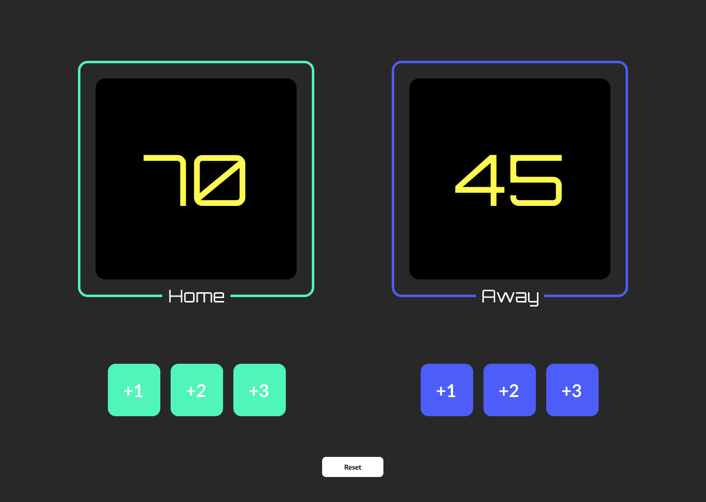

# Aufgabenstellung

Themen:
- Variablen deklarien
- Event Listener hinzufügen
- Funktionen definieren und aufrufen
- Textinhalte mit .innerText bzw. .innerHTML verändern

Anleitung:

- Wir erstellen eine Seite die den aktuellen Stand eines Basketballspiels zeigt
- Die Seite lädt bei einem Anfangsspielstand von 0 - 0
- Wir haben sechs Buttons, die uns erlauben den Mannschaften (Home & Away) entweder 1, 2 oder 3 Punkte hinzuzufügen
- Es gibt noch einen Button (Reset) mit dem wir den Spielstand wieder auf 0 - 0 setzen können

## Assets

__Fonts:__ Orbitron, Lato

__Farben:__ 
#282828, #FFF851, #000000, #FFFFFF, #4FF5B9, #4C5DF8

## Ergebnisvorschau

[Figma](https://www.figma.com/file/KRWquw7lIJcLT8PIDrZnyd/Basketball-Scorekeeper?node-id=0%3A1)

## Bonus Herausforderung

Erstelle einen Button, der ein modales Fenster öffnet, in dem der Benutzer die Teamnamen eingeben kann.